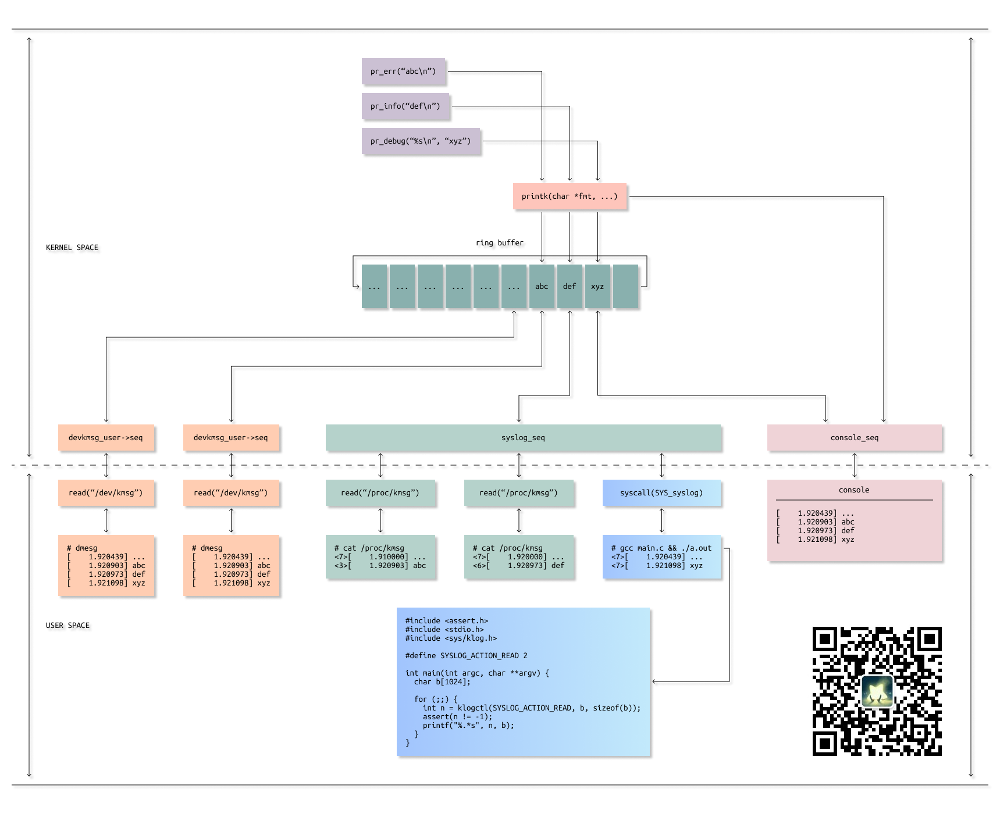
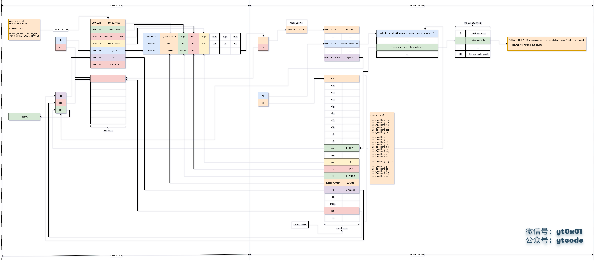
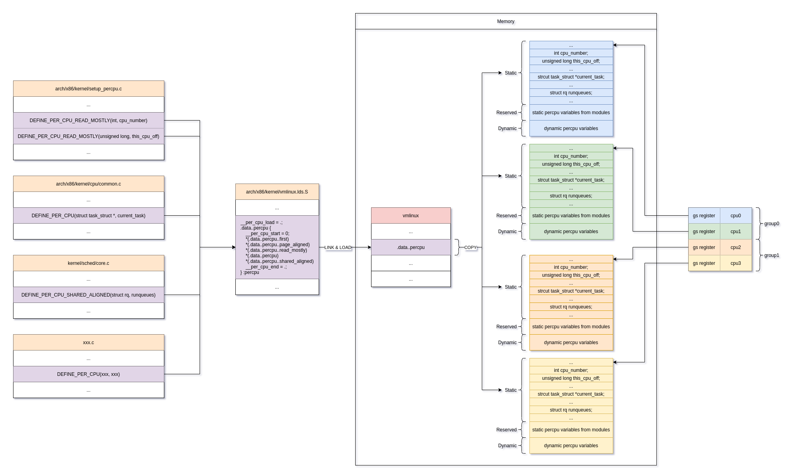
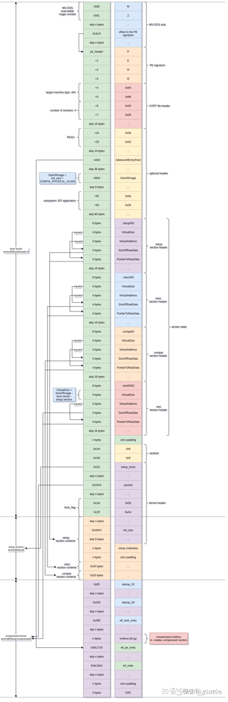

# linux内核分析文章列表（持续更新中...）

- 以下文章均首发于我的个人公众号，对linux内核感兴趣的小伙伴可以关注一下。

- [精致全景图 | linux内核输出的日志去哪里了](https://mp.weixin.qq.com/s/mdDLw6AIp9ws9LTaHg64pg)

- [为什么我的进程被kill掉了](https://mp.weixin.qq.com/s/oNgvmytO3zkddiWZjxKsgg) [「测试代码」](oom-killer/a.c)

- [精致全景图 | 系统调用是如何实现的](https://mp.weixin.qq.com/s/DQXn3ooGGpVNfZtKU1f-Lw)

- [精致全景图 | 程序是如何运行起来的](https://mp.weixin.qq.com/s/SR5RM80a7Hk0aH-23o3Mbw)

- [一张图看懂linux内核中percpu变量的实现](https://mp.weixin.qq.com/s/CwBmsJcKYEI6wejqollbpg)

- [内存地址中藏着的学问](https://mp.weixin.qq.com/s/1hgWZMp1i4A9RmyGfVkDpA)

- [有了这张图，看谁还能阻拦我研究linux内核源码！](https://mp.weixin.qq.com/s/ffYBke1o_5AfzDOHxs7l9Q)

